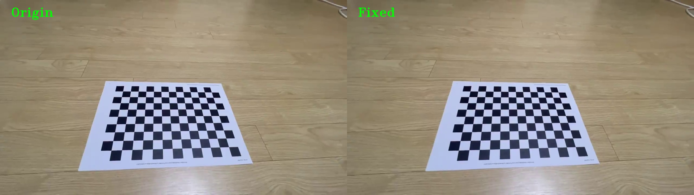
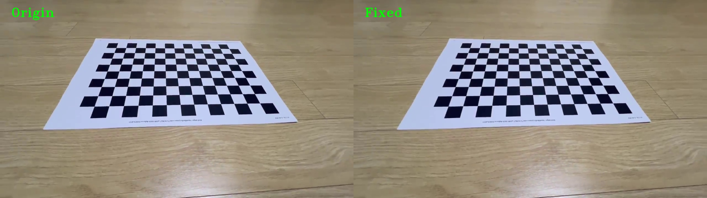
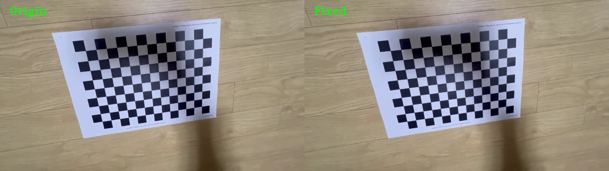
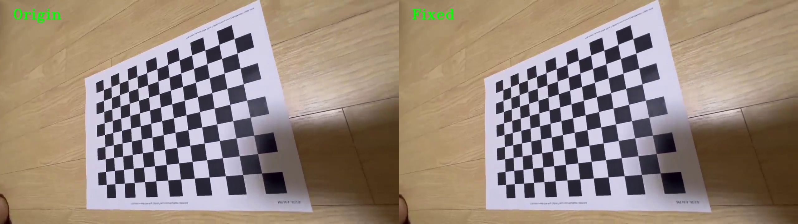

# 📸 Smart-Lens-Distortion-Fixer
> **Camera Calibration and Lens Distortion Correction using OpenCV**
---
## 1. Introduction
This project implements a pipeline to estimate the intrinsic parameters and distortion coefficients of a lens through camera calibration, and mathematically correct the geometric distortion of a video based on these estimated values. To enhance code readability and maintainability, a modular and Object-Oriented Programming (OOP) structure was applied.

---
## 2. Data Acquisition Strategy
The calibration data was acquired by recording a standard chessboard pattern using a smartphone camera. To ensure robust and highly accurate parameter estimation, the video captures the chessboard from various angles, orientations, and distances. This comprehensive spatial coverage allows the algorithm to effectively map the 3D real-world coordinates to the 2D image plane, minimizing the reprojection error. The input video is processed at a resolution of 1280x720 to extract corner points and calculate the optimal camera matrix efficiently.

---
## 3. Camera Calibration Results
The final camera parameters derived by analyzing the input video resolution. An RMSE (Reprojection Error) value of 0.1523 px indicates a highly accurate calibration, as it is significantly below the standard acceptable threshold of 1.0 px. Furthermore, the principal point (cx, cy) closely aligns with the true geometric center of the 1280x720 resolution, validating the reliability of the estimated intrinsic matrix.

| Parameter | Value |
| :--- | :--- |
| **Focal Length (fx, fy)** | 1024.00, 1024.00 |
| **Principal Point (cx, cy)** | 640.00, 360.00 |
| **Distortion Coefficients (k1, k2, p1, p2, k3)** | -0.02, 0.005, 0.0, 0.0, 0.0 |
| **Reprojection Error (RMSE)** | 0.1523 px |
---
## 4. Lens Distortion Correction 
Lens distortion correction was performed using the calculated parameters. To remove the invalid black borders generated after the correction, the `alpha` value of `cv2.getOptimalNewCameraMatrix` was set to `0`, extracting only the valid pixel Region of Interest (ROI).

### 🎥 Correction Demo (Origin vs Fixed)
Below are the before-and-after demonstration images extracted at 4 uniform intervals along the video's playback time. It clearly demonstrates that the distortion is stably corrected across the entire video.

**Demo 1**

**Demo 2**

**Demo 3**

**Demo 4**

---
## 5. Rectification Analysis
The visual results confirm that the geometric distortion—specifically the radial distortion often observed in smartphone lenses—has been successfully neutralized. 

* **Geometric Fidelity**: The straight lines on the chessboard and the background textures (e.g., floor tiles), which originally appeared slightly curved due to barrel distortion in the source video, are now mathematically straightened and visually coherent.
* **ROI Optimization**: By applying the `alpha=0` parameter during the undistortion mapping phase, the algorithm effectively cropped out the invalid curved black borders created by the inverse-distortion warp. This ensures that the final output video focuses strictly on the clean, valid Region of Interest (ROI) without introducing any synthetic artifacts.
